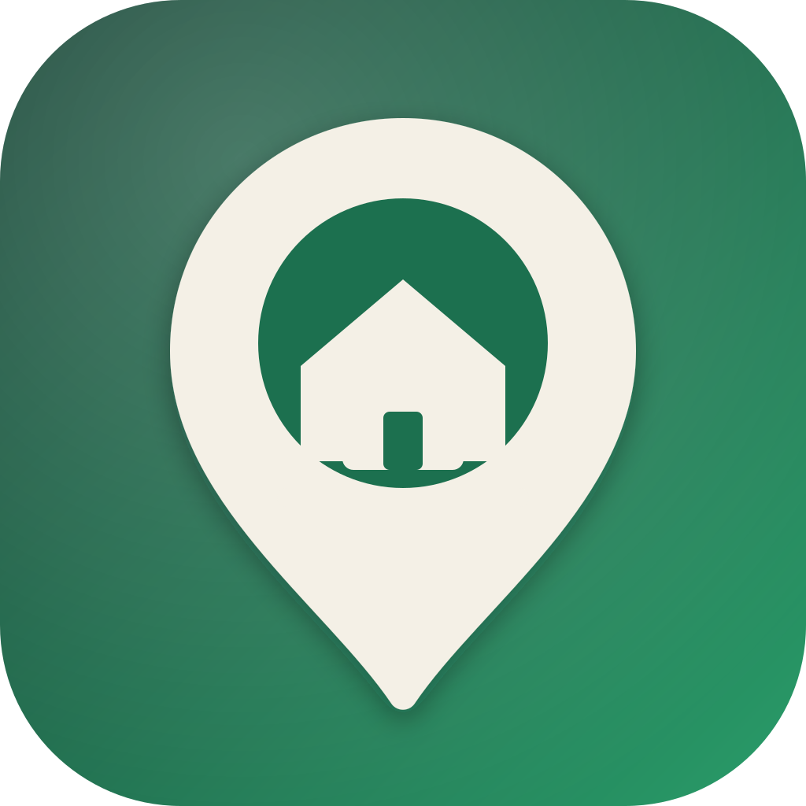

  

# Coolock Village

Open civic tooling for practical local coordination.

This organization publishes community-focused software and automation projects that are useful, maintainable, and easy to contribute to.

Some core platform work is intentionally not public yet while documentation and release workflow are being finalized. Our first public release focus is a Home Assistant todo-list workflow for local operations.

Learn more at [coolockvillage.ie](https://coolockvillage.ie).

## What You Will Find Here

- Home Assistant utilities and automation helpers
- Lightweight civic workflow tooling
- Public docs and release-ready components

## Working Style

- Practical over performative
- Documentation-first
- Clear issue tracking and incremental delivery

## Contributing

When repositories open, each project will include setup instructions, issue labels, and contribution guidance.
